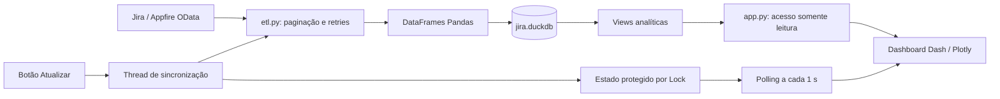

# Gestão Técnica do Código — Dashboard Jira CCEE

Este manual descreve a arquitetura e as práticas para manter o dashboard de demandas de regras. Foi atualizado com base nos arquivos presentes no repositório (`app.py`, `etl.py`, `launcher.py`, folhas CSS e configuração de deploy). Números de registros e cadernos variam com cada sincronização; por isso, não são tratados como constantes do sistema.

## 1. Visão da solução

O projeto separa extração, armazenamento analítico e interface. O ETL consulta quatro entidades do feed OData do Appfire/Jira, grava o snapshot no DuckDB em transação, e o Dash lê as views para montar as análises.

### Arquivos

| Arquivo | Responsabilidade |
| --- | --- |
| `etl.py` | Extração OData, normalização de colunas, tabelas e views analíticas, atualização transacional do banco. |
| `app.py` | Aplicação Dash, consultas ao DuckDB, navegação, tema, visualizações, filtros, exportação CSV e sincronização iniciada pela interface. |
| `launcher.py` | Inicialização local: escolhe porta livre entre 8050 e 8099, ajusta o diretório de execução e abre o navegador. |
| `assets/theme.css` | Regras visuais do tema claro/escuro e componentes Dash. |
| `assets/dashboard-layout.css` | Layout de tela, menu lateral, seções, responsividade e rolagem. |
| `requirements.txt` | Dependências Python da aplicação e do ETL. |
| `Procfile` | Comando do processo web usado pelo ambiente de deploy (Gunicorn). |

## 2. ETL e modelo de dados (`etl.py`)

### Extração

`ENTITIES` define as entidades necessárias: `Issues`, `Categorias`, `Subtarefas` e `Sprints`. `fetch_odata_entity()` percorre as páginas indicadas por `@odata.nextLink`, usa uma sessão HTTP, timeout de conexão/leitura `(15, 180)` e até quatro tentativas por página, com espera progressiva. Eventos de página e falhas transitórias são enviados ao callback de progresso.

`clean_colname()` converte nomes recebidos em identificadores de coluna padronizados. Os dados extraídos são reunidos em DataFrames Pandas antes do início da escrita no banco. Entidade obrigatória vazia interrompe a carga.

### Banco e views

O arquivo `jira.duckdb` fica ao lado do código em execução; no executável, fica ao lado do executável. `create_views()` atualiza:

- **`v_issues_analytics`**: une issues a categorias e expõe situação, datas interpretadas, mês, lead time, aging, faixa de aging, horas, relator, sprint, story points, dados do item pai e classificação de versão regulatória.
- **`v_cadernos_analytics`**: agrega demandas por item pai/caderno, com contagens concluídas e abertas, percentual de conclusão, lead time médio e versão.

`meta_sync` armazena o horário da carga e o total de issues. O nome da coluna `last_sync` é utilizado pelo dashboard para informar a última atualização.

### Atualização atômica

`run_etl()` extrai e valida todas as entidades primeiro; depois abre uma transação DuckDB, substitui as tabelas, recria as views e atualiza `meta_sync`. Só confirma a transação após concluir todas as etapas. Em caso de erro, executa rollback para manter o snapshot anterior. O retorno contém `total_issues`, contagens por entidade e duração da execução.

## 3. Aplicação e experiência de uso (`app.py`)

### Navegação e apresentação

O dashboard organiza quatro módulos principais em um menu lateral recolhível: **Cadernos e Versões**, **Demandas Finalizadas**, **Consultas Técnicas** e **Visão Geral**. Cada módulo é dividido em seções internas (filtros/indicadores, gráficos, tabelas e detalhamento, conforme o módulo). A navegação de seção mantém as páginas no layout e alterna a seção ativa.

O tema claro/escuro é alternado pelo controle lateral e salvo em `dcc.Store(storage_type="local")`, persistindo no navegador. Os estilos ficam em `assets/theme.css`; estrutura, dimensionamento, estados do menu e responsividade ficam em `assets/dashboard-layout.css`. Ao alterar IDs ou classes de componentes no Python, confira os seletores CSS relacionados.

### Módulos analíticos

- **Cadernos e Versões**: progresso por caderno, comparação das versões 2026/2027, escopo CLIQ 16/17, status, filtros, tabela, exportação CSV e detalhamento das demandas do caderno selecionado.
- **Demandas Finalizadas**: registros de demanda filhos diretos do épico configurado em `DEMANDAS_FINALIZADAS_PARENT_KEY` (atualmente `REGRA-305`), resumo das subtarefas, gráficos, filtros, exportação e drill-down.
- **Consultas Técnicas**: acompanhamento de consultas com situação, aging, relator, meta e conformidade de SLA e tema regulatório; inclui indicadores, gráficos, tabela e exportação.
- **Visão Geral**: panorama das issues com filtros por tipo, prioridade e situação, indicadores, gráficos e tabela com busca e exportação.

Os filtros e tabelas trabalham sobre os dados retornados pelas funções de acesso. Não fixe no manual totais atuais de issues, consultas, cadernos ou subtarefas, pois mudam conforme o snapshot.

### Acesso ao DuckDB e comentário recente

As funções `get_data()`, `get_cadernos_data()`, `get_demandas_finalizadas_data()` e `get_demanda_subtarefas()` consultam o banco em modo `read_only=True`. O caminho do banco é calculado em relação à aplicação/executável. `get_latest_jira_comment()` inspeciona as colunas disponíveis na tabela `issues` e procura campos conhecidos de texto, autor e data; o card apresenta o comentário mais recente quando esses campos foram incluídos no feed. Portanto, a disponibilidade depende da configuração de Comments no conector Appfire.

### Sincronização sem bloquear a interface

O botão **Atualizar** inicia `start_sync_worker()`, que impede uma segunda carga concorrente no mesmo processo e dispara `run_sync_worker()` numa thread daemon. `SYNC_STATE` é lido e alterado sob `SYNC_STATE_LOCK`. Um `dcc.Interval` consulta o estado a cada segundo para atualizar o indicador/barra e a mensagem de resultado. Ao fim, callbacks recebem um gatilho para recarregar os dados. `describe_sync_error()` converte falhas comuns de rede, timeout, HTTP e banco em mensagens acionáveis e informa a preservação do snapshot anterior.

Esse estado é local ao processo Python; se o deploy executar múltiplos workers, cada worker terá seu próprio estado em memória. Ajuste a estratégia de sincronização antes de escalar para múltiplos processos concorrentes.

## 4. Inicialização, deploy e empacotamento

- **Execução Python local:** `python launcher.py`. O launcher importa o Dash, seleciona uma porta disponível de 8050 a 8099 e abre o endereço local no navegador. `app.py` também pode ser iniciado diretamente para execução no servidor Dash configurado no arquivo.
- **Deploy web:** `Procfile` define o processo Gunicorn. `requirements.txt` mantém as bibliotecas necessárias; avalie compatibilidade de versões antes de atualizar dependências.
- **Executável Windows:** `launcher.py` detecta o modo congelado e resolve o diretório do banco ao lado do executável. `RESOURCE_DIR` usa `_MEIPASS` para localizar os assets empacotados. Ao alterar CSS ou incluir assets, confirme que a configuração de build os inclui.

No deploy, valide que o diretório do banco existe e tem permissão de escrita para o ETL; para persistência entre reinicializações, use armazenamento persistente do provedor. O servidor Dash está configurado sem modo debug/reloader; alterações no código exigem reiniciar o processo.

## 5. Procedimentos de evolução

### Adicionar um campo do Jira

1. Confirme que o campo está disponível na entidade correta do feed OData.
2. Confira o nome sanitizado por `clean_colname()` e se a tabela física o recebeu.
3. Se o campo for usado em análises, inclua-o explicitamente na view correspondente em `create_views()` e defina conversão/defaults apropriados (`TRY_CAST`, `COALESCE`).
4. Leia o campo na função DAL necessária e conecte-o a filtros, indicadores ou tabelas.
5. Se necessário, atualize exportações e a documentação do módulo.

### Adicionar análise ou filtro

1. Coloque os componentes no layout do módulo em `app.py`, atribuindo IDs únicos.
2. Atualize as entradas e saídas do callback correspondente e trate seleções vazias/“Todos”.
3. Faça as agregações sobre o DataFrame filtrado; para novas regras reutilizadas por vários módulos, prefira centralizá-las na view analítica.
4. Aplique os tokens de cor em `COLORS` e estilos compatíveis com os temas claro e escuro.
5. Se adicionar uma seção inteira, revise `SECTION_TITLES` e `SECTION_GROUPS`, além dos estilos e dos callbacks que usam os IDs.

### Atualizar o manual

Documente comportamento observado no código, não totais incidentais do banco. Ao introduzir função, tabela/view, componente de navegação, integração ou configuração de deploy, atualize a seção correspondente e remova descrições antigas que deixaram de ser verdade.

## 6. Segurança e governança

- O feed OData é configurado em `FEED_BASE_URL` no código. Trate esse identificador como informação interna; a evolução recomendada é carregá-lo de configuração protegida/variável de ambiente antes de distribuir o repositório ou o executável.
- A extração usa `verify=False` e suprime o aviso de certificado para compatibilidade com inspeção SSL corporativa. Isso desativa a validação TLS do cliente; prefira configurar a cadeia de certificados confiável quando o ambiente permitir.
- A interface abre o DuckDB em leitura; apenas o ETL escreve. Preserve essa separação ao criar novas rotinas.
- Não registre tokens, credenciais nem URLs completas sensíveis em mensagens de erro ou logs.
- Mantenha alterações de código revisáveis e descreva mudanças relevantes nos commits. O histórico atual inclui commits de correção de `Procfile` e ajustes de deploy Railway; confirme também o comportamento da plataforma ao alterar comando, porta, armazenamento ou número de workers.

## 7. Verificação antes de publicar

- Verifique se os quatro nomes de entidade do feed estão corretos e não retornam DataFrames vazios.
- Confirme que tabelas, views e `meta_sync` foram atualizadas pela carga e que uma falha durante a carga não substitui o snapshot anterior.
- Confira callbacks e IDs após mudança de layout, em especial navegação de seção, troca de tema, sincronização e exportações.
- Confirme que `jira.duckdb` e `assets/` são encontrados tanto na execução Python quanto no executável/deploy.
- Revise dependências, `Procfile`, diretório persistente e quantidade de workers ao publicar.
