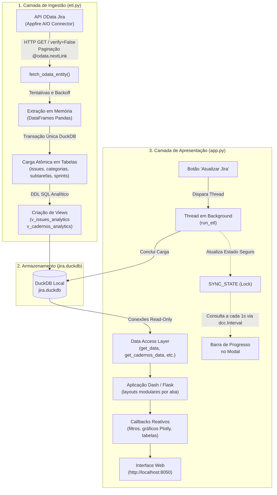

# Manual de Engenharia e Gestão dos Códigos Python — Painel Jira CCEE

Este documento estabelece a documentação técnica de governança, arquitetura e lógica de implementação de todos os códigos Python do projeto (**`etl.py`** e **`app.py`**). Seu objetivo é permitir que qualquer desenvolvedor, engenheiro de dados ou analista da CCEE compreenda a motivação de cada módulo, a lógica interna das funções, o fluxo de dados e como manter ou evoluir a base com segurança.

---

## 1. Visão Geral da Arquitetura de Software

A solução é construída sob uma arquitetura desacoplada em três camadas: **Ingestão/ETL**, **Repositório Analítico Colunar** e **Apresentação Web Interativa**:



---

## 2. Módulo de Ingestão e Modelagem Analítica (`etl.py`)

* **Arquivo:** [`etl.py`](file:///c:/Users/mleal/OneDrive%20-%20ccee.org.br/Documents/VS%20CODE/Teste%206%20-%20BI/etl.py)
* **Tamanho aproximado:** ~300 linhas de código Python.
* **Dependências principais:** `duckdb`, `pandas`, `requests`, `urllib3`, `re`, `time`.

### 2.1. Objetivo Central
Extrair de forma exaustiva e automatizada as quatro entidades centrais expostas pelo conector AIO Jira via protocolo OData (`Issues`, `Categorias`, `Subtarefas`, `Sprints`), normalizar os esquemas de dados, criar o modelo analítico relacional no DuckDB e materializar as visões analíticas (`v_issues_analytics` e `v_cadernos_analytics`), garantindo **atomicidade** (preservação do último snapshot válido em caso de falha).

---

### 2.2. Lógica Passo a Passo das Funções de `etl.py`

#### A. Tratamento de Rede e Normalização de Colunas
* **`urllib3.disable_warnings(InsecureRequestWarning)`:**
  - *Por que existe:* O proxy corporativo e firewalls da CCEE realizam inspeção profunda de pacotes (SSL Interception), emitindo certificados emitidos pela Autoridade Certificadora interna. Sem essa diretiva combinada a `verify=False`, a biblioteca `requests` interrompe a execução com erro de cadeia de certificados não confiável (`SSLCertVerificationError`).
* **`clean_colname(col: str) -> str`:**
  - *Objetivo:* Converter qualquer nome de coluna bruto vindo do JSON em um identificador SQL válido, determinístico e legível (`snake_case`).
  - *Lógica interna:*
    1. Remove caracteres especiais como `*`, `:`, `/`, `-`, `(`, `)`, `'`.
    2. Substitui caracteres acentuados da língua portuguesa (`ç` $\to$ `c`, `ã`/`á` $\to$ `a`, `é` $\to$ `e`, etc.).
    3. Converte múltiplos espaços em um único sublinhado `_`.
    4. Converte tudo para minúsculas (`.lower()`) e remove sublinhados residuais nas extremidades.
  - *Exemplo:* `"Relator:  Name"` $\to$ `"relator_name"`; `"Resolução"` $\to$ `"resolucao"`.

---

#### B. Extração Paginada e Resiliente (`fetch_odata_entity`)
* **Assinatura:** `fetch_odata_entity(entity_name: str, session: requests.Session, progress_callback=None) -> pd.DataFrame`
* **Lógica interna:**
  1. Constrói o endpoint inicial: `url = f"{FEED_BASE_URL}/{requests.utils.quote(entity_name)}"`.
  2. Executa um laço `while url:` que itera pelas páginas através do metadado `@odata.nextLink` retornado pelo Appfire.
  3. **Mecanismo de Tolerância a Falhas:** Cada página tem até `MAX_PAGE_ATTEMPTS = 4` tentativas com tempo de espera exponencial progressivo (`wait_seconds = 3 * (2 ** (attempt - 1))`), tratando instabilidades transitórias de proxy, respostas HTTP 502/504 e timeouts de leitura.
  4. **Timeout Configurado:** `REQUEST_TIMEOUT = (15, 180)` (15s para handshake de conexão e até 180s para leitura, permitindo ao Appfire tempo suficiente para gerar páginas pesadas).
  5. **Tratamento de Páginas Vazias:** Em pipelines OData do Appfire, algumas páginas intermediárias retornam `value: []` enquanto o servidor conclui a indexação. O loop acumula apenas quando há itens e segue o `@odata.nextLink` sem abortar.
  6. **Notificação de Progresso:** A cada página concluída ou tentativa de reconexão, invoca `progress_callback` informando entidade, página e total de registros já lidos.
  7. Retorna um `pd.DataFrame` consolidado com colunas normalizadas por `clean_colname`.

---

#### C. Criação das Views Analíticas (`create_views`)
* **Assinatura:** `create_views(con: duckdb.DuckDBPyConnection)`
* **Objetivo:** Desacoplar regras de negócio do frontend e centralizá-las no mecanismo SQL colunar do DuckDB.
* **Views geradas:**
  1. **`v_issues_analytics`:**
     - `situacao`: `'Concluído'` se `resolucao IS NOT NULL AND resolucao != 'Unresolved'`; senão `'Em Aberto'`.
     - `data_criacao` e `data_resolucao`: Timestamps convertidos via `TRY_CAST`.
     - `lead_time_dias`: $DATEDIFF('day', criado, resolvido)$ para itens concluídos.
     - `aging_dias`: $DATEDIFF('day', criado, CURRENT\_TIMESTAMP)$ exclusivo para itens em aberto.
     - `faixa_aging`: Segmentação do backlog pendente em 4 faixas normativas (`Até 15 dias`, `16 a 30 dias`, `31 a 60 dias`, `Mais de 60 dias`).
     - `categorias`: Agregação temática via `STRING_AGG(c.categorias, ', ')` agrupando múltiplos marcadores regulatórios associados à mesma chave.
     - `versao_regra`: Classificação automática em `'Versão 2026'`, `'Versão 2027'` ou `'Outros / Operacional'` com base em expressões no item pai ou nas categorias.
  2. **`v_cadernos_analytics`:**
     - Agrupa as demandas por `parent_key` e calcula métricas executivas por caderno pai: total de demandas filhas, concluídas, em aberto, percentual de entrega e lead time médio por caderno.

---

#### D. Orquestração Transacional Atômica (`run_etl`)
* **Assinatura:** `run_etl(progress_callback=None) -> dict`
* **Garantia de Atomicidade (Zero Corrupção de Snapshot):**
  - **Fase 1 (Extração Segura em Memória):** Todas as entidades (`Issues`, `Categorias`, `Subtarefas`, `Sprints`) são extraídas e transformadas em DataFrames **antes** de abrir qualquer transação de escrita no banco de dados. Se a rede cair durante a extração de `Subtarefas`, o banco `jira.duckdb` nem sequer é tocado.
  - **Fase 2 (Validação de Integridade):** Verifica se `Issues` possui registros. Se vier vazio, aborta com erro explícito.
  - **Fase 3 (Transação Atômica DDL/DML):**
    ```python
    con = duckdb.connect(DUCKDB_PATH)
    con.execute("BEGIN TRANSACTION")
    # Substitui tabelas físicas temporárias pelas finais
    # Recria v_issues_analytics e v_cadernos_analytics
    # Grava meta_sync com timestamp exato e total de issues
    con.execute("COMMIT")
    ```
  - Em caso de qualquer erro durante a escrita, é executado `con.execute("ROLLBACK")`, preservando integralmente o último snapshot válido.

---

## 3. Aplicação Web Analítica e Interface (`app.py`)

* **Arquivo:** [`app.py`](file:///c:/Users/mleal/OneDrive%20-%20ccee.org.br/Documents/VS%20CODE/Teste%206%20-%20BI/app.py)
* **Tamanho aproximado:** ~2.100 linhas de código Python.
* **Framework:** Dash (Plotly) + Dash Bootstrap Components (`dbc.themes.FLATLY`) + FontAwesome 6.4.

---

### 3.1. Arquitetura de Estado e Execução Assíncrona (Thread-Safe)

O dashboard opera sem bloquear o servidor quando o usuário solicita uma sincronização com o Jira:

* **Variáveis Globais de Estado:**
  ```python
  SYNC_STATE_LOCK = threading.Lock()
  SYNC_STATE = {
      "status": "idle",       # idle | running | success | error
      "percent": 0,           # 0 a 100
      "message": "",          # Mensagem informativa de página/entidade
      "result": None,         # Dicionário com totais por entidade
      "completed_at": None    # Timestamp de conclusão
  }
  ```
* **Funções Thread-Safe:**
  - `update_sync_state(**changes)`: Atualiza o dicionário de estado protegendo contra *race conditions* via `with SYNC_STATE_LOCK:`.
  - `get_sync_state()`: Retorna uma cópia consistente do estado atual para ser consumida pelos callbacks do frontend.
  - `describe_sync_error(exc)`: Trata a árvore de exceções e retorna mensagens amigáveis sem expor o identificador da URL corporativa do feed OData (ex.: diferencia `ProxyError`, `ReadTimeout`, `HTTPError` e falha de transação SQL).

---

### 3.2. Camada de Acesso a Dados (DAL — Data Access Layer)

Todas as consultas analíticas abrem conexões em modo estrito de leitura (`read_only=True`), permitindo múltiplos acessos concorrentes sem concorrência de bloqueio:

| Função | Consulta SQL Base | Finalidade no Dashboard |
| :--- | :--- | :--- |
| **`get_data()`** | `SELECT * FROM v_issues_analytics` + `SELECT last_sync FROM meta_sync` | Fornece os 611 registros analíticos para a Aba 1 (Visão Geral) e Aba 2 (Consultas Técnicas), além do carimbo da última carga. |
| **`get_cadernos_data()`** | `SELECT * FROM v_cadernos_analytics` | Alimenta a Aba 3 (Cadernos e Versões) com métricas consolidadas dos 95 cadernos e épicos regulatórios. |
| **`get_demandas_finalizadas_data()`** | `SELECT a.*, s.total_subtarefas... FROM v_issues_analytics a WHERE parent_key = 'REGRA-305'` | Fornece os 8 Registros de Demanda finalizados e a contagem de suas 18 subtarefas para a Aba 4. |
| **`get_demanda_subtarefas(key)`** | `SELECT * FROM v_issues_analytics WHERE parent_key = ? AND tipo_de_item = 'Subtarefa'` | Carrega dinamicamente as subtarefas subordinadas a uma demanda específica para o drill-down operacional. |

---

### 3.3. Design System Corporativo (`COLORS` e Cards)

* **Paleta Padronizada (`COLORS`):**
  - `primary`: `#1E3A8A` (Azul Marinho CCEE)
  - `secondary`: `#2563EB` (Azul Real)
  - `success`: `#10B981` (Verde Esmeralda Concluído / No Prazo)
  - `warning`: `#F59E0B` (Âmbar Atenção / Em Aberto)
  - `danger`: `#EF4444` (Vermelho Crítico / Atrasado)
  - `info`: `#06B6D4` (Ciano Informativo)
* **Função `build_kpi_card(title, value, subtitle, icon, color)`:**
  Gera um cartão Bootstrap com sombra sutil (`shadow-sm`), cantos arredondados (`rounded-4`), tipografia moderna, ícone circular temático e texto responsivo.

---

### 3.4. Estrutura Modular das Quatro Abas

O dashboard utiliza renderização dinâmica via callback `render_tab_content(active_tab)`. Isso garante que o navegador só processe os componentes HTML da aba atualmente visível, mantendo o consumo de memória baixo e a interface responsiva:

```text
┌──────────────────────────────────────────────────────────────────────────────┐
│ Header: Logo CCEE | Badge Última Carga | Botão "Atualizar Jira" (Modal Sync) │
├──────────────────────────────────────────────────────────────────────────────┤
│ Tabs: [📘 Cadernos e Versões] [📊 Visão Geral] [🔍 Consultas Técnicas] [✅ Demandas Finalizadas] │
└──────────────────────────────────────────────────────────────────────────────┘
```

#### 📘 Aba 3: Cadernos e Versões 2026/2027 (Tela Inicial Padrão)
* **Objetivo:** Monitoramento executivo dos 95 cadernos de regras de comercialização e acompanhamento do cumprimento dos pacotes CLIQ 16 (2026) e CLIQ 17 (2027).
* **Componentes:**
  - Filtros: Versão Regulatória, Status do Caderno e Tipo de Item Pai.
  - KPIs: Total de Cadernos, Progresso 2026, Progresso 2027, Cadernos 100% Entregues e Volume de Demandas.
  - Gráficos: Termômetro de conclusão horizontal por caderno, comparativo de versões, matriz de escopo CLIQ 16 vs. 17 e rosca de status operacional.
  - Tabela Executiva com formatação condicional (% entregue) e drill-down reativo por caderno selecionado.

#### 📊 Aba 1: Visão Geral de Todas as Demandas
* **Objetivo:** Panorama macro de todas as 611 demandas registradas.
* **Componentes:**
  - Filtros: Tipo de Item (Consulta, História, Registro, Subtarefa, etc.), Prioridade e Situação.
  - KPIs: Volume Total, Em Aberto, Concluídas, Taxa de Conclusão e Lead Time Médio Geral.
  - Gráficos: Distribuição por Tipo (barras empilhadas), Rosca de Prioridades, Ranking de Resolução, Área Temporal de Criação e Lead Time Médio por Tipo.
  - Tabela paginada nativa com busca por coluna e botão de download CSV.

#### 🔍 Aba 2: Consultas Técnicas (Módulo Regulatório e SLA)
* **Objetivo:** Gestão de atendimento a dúvidas técnicas e pareceres regulatórios.
* **Componentes:**
  - Filtros Específicos: Situação, Faixa de Aging, Solicitante/Relator, **Meta de SLA (3 a 30 dias)**, **Conformidade de SLA (No Prazo vs. Fora do Prazo)** e **Tema / Regra Regulatória**.
  - KPIs: Total de Consultas (39), Em Aberto (19), Concluídas (20), **Conformidade de SLA com cor semafórica**, Lead Time Médio e Aging Médio da Fila.
  - Grade 3x2 de Gráficos:
    1. *Gauge de Conformidade de SLA:* Velocímetro com faixas de tolerância (0-60%, 60-85%, 85-100%).
    2. *Temas Regulatórios Mais Consultados:* Barras horizontais de assuntos normativos.
    3. *Aging do Backlog Aberto:* Barras por faixa de gravidade temporal.
    4. *Top Demandantes:* Ranking dos maiores solicitantes.
    5. *Lead Time vs. Meta SLA:* Dispersão por ticket com linha de Meta SLA e linha da Média Histórica.
    6. *Fluxo Mensal:* Entradas vs. Saídas por mês.
  - Tabela com coluna `Status SLA` formatada condicionalmente em verde/vermelho e exportação CSV com dados de SLA.

#### ✅ Aba 4: Demandas Finalizadas
* **Objetivo:** Monitoramento administrativo dos 8 Registros de Demanda filhos do épico `REGRA-305` e suas 18 subtarefas.
* **Componentes:**
  - Filtros: Resolução, Prioridade e Relator.
  - KPIs: Total no Escopo, Concluídas por Tipo de Resolução, Lead Time Médio e Subtarefas Concluídas.
  - Gráficos de resolução, lead time por ticket, conclusões mensais e volume por solicitante.
  - Tabela detalhada e drill-down operacional por demanda selecionada.

---

### 3.5. Ciclo de Vida dos Callbacks e Sincronização

1. **Callback do Botão "Atualizar Jira" (`trigger_jira_sync`):**
   - Ao ser clicado, verifica se `SYNC_STATE["status"] != "running"`.
   - Dispara a execução de `run_etl()` dentro de uma `threading.Thread(target=worker, daemon=True)`.
   - Abre o modal de progresso (`modal-sync`) e ativa o componente `sync-interval` (`disabled=False`).
2. **Callback de Polling de Progresso (`poll_sync_progress`):**
   - Disparado a cada 1.000 ms pelo `dcc.Interval`.
   - Lê `get_sync_state()` e atualiza a barra de progresso `sync-progress-bar`, a mensagem informativa e o badge do header.
   - Quando o status atinge `"success"` ou `"error"`, desativa o intervalo (`disabled=True`) e emite um pulso em `store-data-trigger`.
3. **Barramento Reativo `store-data-trigger`:**
   - Todos os callbacks de gráficos, KPIs e tabelas das 4 abas escutam `Input("store-data-trigger", "data")`.
   - Quando uma sincronização termina com sucesso, todos os componentes de todas as abas recarregam seus dados instantaneamente sem reiniciar a aplicação.

---

## 4. Guia Prático de Manutenção e Evolução

### 4.1. Como Adicionar um Novo Campo Vindo do Jira
1. No Jira (ou no conector AIO), inclua a coluna no relatório.
2. Em [`etl.py`](file:///c:/Users/mleal/OneDrive%20-%20ccee.org.br/Documents/VS%20CODE/Teste%206%20-%20BI/etl.py):
   - A função `clean_colname()` sanitizará o nome automaticamente na tabela física `issues`.
   - Edite a função `create_views()` para incluir o novo campo na view `v_issues_analytics` com o tratamento necessário (`TRY_CAST`, `COALESCE`, etc.).
3. Em [`app.py`](file:///c:/Users/mleal/OneDrive%20-%20ccee.org.br/Documents/VS%20CODE/Teste%206%20-%20BI/app.py):
   - Utilize a nova coluna nos DataFrames retornados por `get_data()`.

---

### 4.2. Como Adicionar um Novo Gráfico em uma Aba
1. Adicione o componente `dcc.Graph(id="novo-grafico-id")` dentro do layout da aba correspondente em `app.py`.
2. No callback de atualização daquela aba, inclua o novo `Output("novo-grafico-id", "figure")`.
3. Na função do callback:
   - Processe os dados filtrados com Pandas.
   - Monte a figura com `px.bar`, `px.pie`, `go.Figure`, etc.
   - Aplique o layout corporativo padrão:
     ```python
     fig.update_layout(
         margin=dict(l=20, r=20, t=10, b=20),
         plot_bgcolor="rgba(0,0,0,0)",
         paper_bgcolor="rgba(0,0,0,0)",
         font=dict(family="Segoe UI, sans-serif")
     )
     ```
   - Retorne a figura na tupla de retorno da função.

---

### 4.3. Como Testar Callbacks sem Abrir o Navegador
Para testar a lógica de qualquer callback de forma determinística e ágil sem depender do clique manual na interface, crie um script temporário em `.gemini/antigravity/brain/.../scratch/` importando a função de callback diretamente:

```python
import sys
sys.path.insert(0, ".")
from app import update_consultas_tecnicas

# Executa diretamente a função do callback simulando os inputs do usuário
kpis, gauge, temas, aging, demandantes, lt, fluxo, tab_data, tab_cols = update_consultas_tecnicas(
    situacao_sel="Todos",
    aging_sel="Todos",
    relator_sel=None,
    meta_sla_sel=5,
    status_sla_sel="No Prazo",
    tema_sel=None,
    _=None
)
print(f"Registros retornados: {len(tab_data)}")
```

---

## 5. Políticas de Qualidade, Segurança e Governança

1. **Credenciais e Endpoints Sensíveis:**
   - O identificador do feed em `FEED_BASE_URL` no [`etl.py`](file:///c:/Users/mleal/OneDrive%20-%20ccee.org.br/Documents/VS%20CODE/Teste%206%20-%20BI/etl.py) não deve ser exposto publicamente. A evolução recomendada é migrar para variável de ambiente (`.env`).
2. **Conexões DuckDB em Modo Read-Only no Servidor Web:**
   - O processo web `app.py` nunca abre o DuckDB para escrita direta nas rotinas de visualização, utilizando sempre `read_only=True`. Apenas a thread controlada de `run_etl()` abre conexão de escrita durante a janela estrita de carga.
3. **Reinicialização do Servidor Local:**
   - Como o Dash está configurado com `debug=False` para garantir performance corporativa e estabilidade multithread, qualquer edição no código Python de `app.py` exige reiniciar o processo Python para recarregar o bundle de componentes.
4. **Convenção de Commits Git:**
   - Todas as alterações de código devem ser commitadas seguindo o padrão **Conventional Commits** (`feat:`, `fix:`, `docs:`, `refactor:`, `chore:`).
